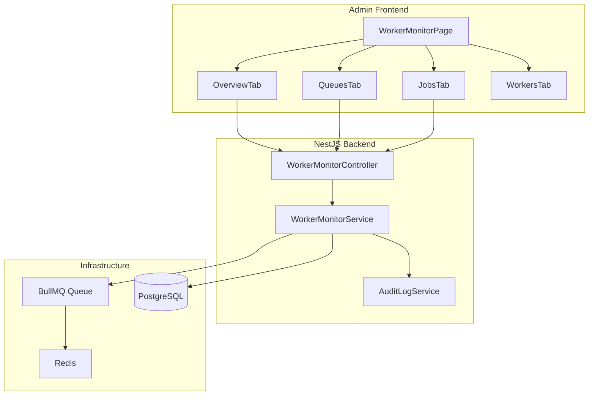
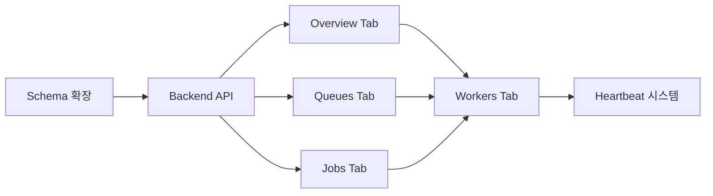

# Worker Monitor 구현 플랜

## 아키텍처 개요



---

## Phase 1: Backend API 구현

### 1.1 Prisma 스키마 확장

[`prisma/schema.prisma`](prisma/schema.prisma) 파일에 추가:

```prisma
// WorkerHeartbeat - 워커 상태 추적
model WorkerHeartbeat {
  id            String       @id @default(cuid())
  workerId      String       @unique @map("worker_id")
  queueName     String       @map("queue_name")
  status        WorkerStatus @default(ONLINE)
  hostname      String?
  version       String?
  pid           Int?
  activeJobs    Int          @default(0) @map("active_jobs")
  processedJobs Int          @default(0) @map("processed_jobs")
  failedJobs    Int          @default(0) @map("failed_jobs")
  lastHeartbeat DateTime     @map("last_heartbeat")
  startedAt     DateTime     @map("started_at")
  createdAt     DateTime     @default(now()) @map("created_at")
  updatedAt     DateTime     @updatedAt @map("updated_at")
  @@map("worker_heartbeats")
}

enum WorkerStatus { ONLINE OFFLINE DEGRADED }

// AuditAction enum 확장
enum AuditAction {
  // 기존 값들...
  QUEUE_PAUSE
  QUEUE_RESUME
  QUEUE_DRAIN
  QUEUE_CLEAN
  JOB_RETRY
  JOB_CANCEL
}

enum EntityType {
  // 기존 값들...
  QUEUE
  WORKER
}
```


### 1.2 Worker Monitor 모듈 생성

**파일 구조:**

```javascript
apps/api/src/modules/worker-monitor/
├── worker-monitor.module.ts
├── worker-monitor.controller.ts
├── worker-monitor.service.ts
├── dto/
│   ├── overview.dto.ts
│   ├── queue-stats.dto.ts
│   ├── queue-action.dto.ts
│   └── job-query.dto.ts
└── constants/
    └── index.ts
```

**핵심 API 엔드포인트:**| Method | Endpoint | 기능 ||--------|----------|------|| GET | `/admin/worker-monitor/overview` | KPI 통계 + 이상 징후 || GET | `/admin/worker-monitor/queues` | 큐 목록 + 상태 || GET | `/admin/worker-monitor/queues/:name` | 큐 상세 (트렌드 포함) || POST | `/admin/worker-monitor/queues/:name/pause` | 큐 일시정지 || POST | `/admin/worker-monitor/queues/:name/resume` | 큐 재개 || POST | `/admin/worker-monitor/queues/:name/retry-failed` | 실패 작업 재시도 || DELETE | `/admin/worker-monitor/queues/:name/drain` | 대기 작업 제거 || GET | `/admin/worker-monitor/jobs` | Job 목록 (필터/페이징) || GET | `/admin/worker-monitor/jobs/:id` | Job 상세 || POST | `/admin/worker-monitor/jobs/:id/retry` | Job 재시도 || GET | `/admin/worker-monitor/workers` | 워커 목록 |**BullMQ 서비스 핵심 로직:**

```typescript
// worker-monitor.service.ts 핵심 메서드
async getQueueStats(queueName: string) {
  const queue = this.getQueue(queueName);
  const [counts, isPaused, workers] = await Promise.all([
    queue.getJobCounts('waiting', 'active', 'delayed', 'completed', 'failed'),
    queue.isPaused(),
    queue.getWorkers(),
  ]);
  // 처리량, 평균 duration 계산 로직
}

async pauseQueue(queueName: string, adminId: string) {
  await queue.pause();
  await this.auditLogService.log({ action: 'QUEUE_PAUSE', ... });
}
```


### 1.3 App Module 등록

[`apps/api/src/app.module.ts`](apps/api/src/app.module.ts)에 WorkerMonitorModule import 추가---

## Phase 2: Admin Frontend 구현

### 2.1 네비게이션 업데이트

[`apps/admin/src/components/AdminLayout.tsx`](apps/admin/src/components/AdminLayout.tsx)의 NAV_ITEMS에 추가:

```typescript
{ label: '워커 모니터', icon: Memory, href: '/worker-monitor' },
```


### 2.2 Worker Monitor 페이지 구조

**파일 구조:**

```javascript
apps/admin/src/app/worker-monitor/
├── page.tsx              # 메인 페이지 (탭 컨테이너)
└── components/
    ├── OverviewTab.tsx   # KPI 카드 + Incident 배너
    ├── QueuesTab.tsx     # 큐 테이블 + 상세 패널
    ├── JobsTab.tsx       # Job 스트림 + 필터
    ├── WorkersTab.tsx    # 워커 목록
    └── shared/
        ├── KPICard.tsx
        ├── StatusChip.tsx
        ├── IncidentBanner.tsx
        ├── ActionConfirmDialog.tsx
        ├── QueueDetailPanel.tsx
        └── JobDetailDrawer.tsx
```


### 2.3 Overview Tab 설계

**KPI 카드 6개:**

- Online Workers (워커 수)
- Waiting (대기 중 작업)
- Delayed (지연된 작업)
- Failed 24h (24시간 실패)
- Success Rate (성공률)
- Avg/P95 Duration (처리 시간)

**Incident 배너:**

- 대기열 급증, 실패율 급등 등 이상 징후 자동 표시
- 1클릭 드릴다운 (해당 탭으로 필터 적용 이동)

### 2.4 Queues Tab 설계

**테이블 컬럼:**

- Queue Name (한글 별칭)
- Status (Running/Paused/Degraded)
- Waiting/Active/Delayed/Failed 카운트
- Throughput (jobs/min)
- Last Processed

**상세 패널 (Row 클릭 시):**

- 1시간 트렌드 미니 차트
- Top Error Reasons
- Actions: Pause/Resume, Retry Failed, Drain (위험)

### 2.5 Jobs Tab 설계

**필터:**

- Queue, Status, Job Type, User, Time Range

**테이블 컬럼:**

- Status, Type, User, Attempts, Duration, Error, Created

**Job 상세 Drawer:**

- 한글 요약 (무슨 작업이 왜 실패했는지)
- Error Raw (expandable)
- Attempts History
- Artifacts (스크린샷, HTML 스냅샷)
- Actions: Retry, Cancel

### 2.6 위험 액션 안전장치

```typescript
// DangerActionDialog.tsx
<Dialog>
  <DialogTitle>⚠️ 위험한 작업</DialogTitle>
  <DialogContent>
    <Typography>이 작업은 취소할 수 없습니다.</Typography>
    <Typography color="error">
      영향 범위: 대기 중인 작업 {count}개가 삭제됩니다.
    </Typography>
    <TextField 
      label="확인을 위해 'DRAIN'을 입력하세요" 
      // ...
    />
  </DialogContent>
</Dialog>
```

---

## Phase 3: Worker Heartbeat 시스템

### 3.1 Worker 측 Heartbeat 전송

[`apps/worker/src/main.ts`](apps/worker/src/main.ts)에 추가:

```typescript
const WORKER_ID = `worker-${hostname()}-${process.pid}`;

setInterval(async () => {
  await prisma.workerHeartbeat.upsert({
    where: { workerId: WORKER_ID },
    update: { 
      lastHeartbeat: new Date(), 
      activeJobs: worker.isRunning() ? 1 : 0 
    },
    create: { ... }
  });
}, 10000); // 10초마다
```


### 3.2 워커 상태 판정 로직

```typescript
// 30초 이상 heartbeat 없으면 OFFLINE
// 실패율 30% 이상이면 DEGRADED
```

---

## 구현 순서 및 의존성



---

## 핵심 파일 변경/생성 목록

**신규 생성:**

- `apps/api/src/modules/worker-monitor/` (전체 모듈)
- `apps/admin/src/app/worker-monitor/` (전체 페이지)
- `apps/admin/src/lib/admin-api-client.ts`

**수정:**

- `prisma/schema.prisma` (스키마 확장)
- `apps/api/src/app.module.ts` (모듈 등록)
- `apps/admin/src/components/AdminLayout.tsx` (네비게이션)
- `apps/worker/src/main.ts` (Heartbeat 추가)

---

## 기술적 고려사항

1. **BullMQ Queue 인스턴스 공유**: API에서 JobProducer와 동일한 Queue 인스턴스 재사용
2. **권한 검증**: 모든 엔드포인트에 AdminGuard 적용
3. **Audit Log 필수**: Queue 조작, Job 재시도 등 모든 액션 기록