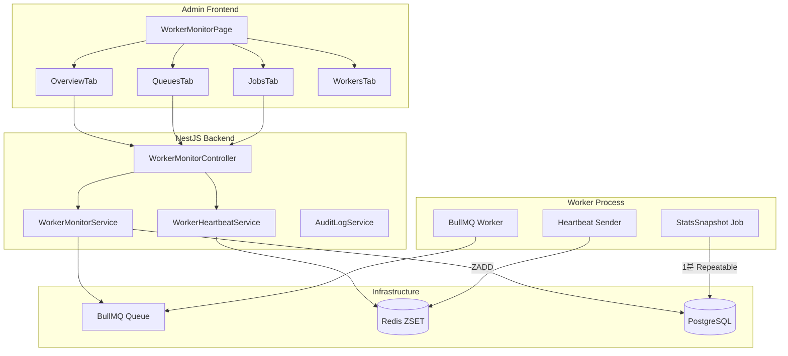

# Worker Monitor 구현 플랜 (v3 - Final)

> 우선순위 기반 단계적 구현: P0(수집/조회) → P1(조치/잡 운영) → P2(Incident 운영판) → P3(성능/고급)

---

## 우선순위 요약

| Phase | 목표 | 핵심 산출물 |
|-------|------|-------------|
| **P0** | 데이터가 안정적으로 들어오고, 화면이 살아있게 | Schema, Heartbeat, StatsSnapshot, 조회 API 3개, Admin 탭 뼈대 |
| **P1** | 관리자가 실제로 조치를 안전하게 할 수 있게 | Queue Actions, Job CRUD, AuditLog, DangerDialog |
| **P2** | "지금 이상함"을 자동으로 알려주되 단순하고 정확하게 | IncidentDetector, Incidents API/탭, IncidentBanner |
| **P3** | 성능 모니터링 + 고급 운영 기능 | p95, 실시간 스트림, 알림 채널, 멀티 큐 |

---

## 아키텍처 개요



---

# P0: 수집/조회 (화면이 살아있게)

> 목표: 워커/큐/스냅샷이 끊기지 않고 수집되고, Admin에서 실시간 상태를 "조회"할 수 있어야 함

## P0-1. DB 스키마/마이그레이션

### Prisma 스키마 추가 (`prisma/schema.prisma`)

```prisma
// ==============================================
// Worker Monitor - 시계열 스냅샷
// ==============================================

/// 큐 통계 스냅샷 (1분 단위 수집)
model QueueStatsSnapshot {
  id            String   @id @default(cuid())
  queueName     String   @map("queue_name")
  
  // 작업 카운트
  waiting       Int      @default(0)
  active        Int      @default(0)
  delayed       Int      @default(0)
  completed     Int      @default(0)
  failed        Int      @default(0)
  
  // 큐 상태
  paused        Boolean  @default(false)
  
  // 성능 지표 (P0에서는 jobsPerMin만, 나머지는 P3)
  jobsPerMin    Int?     @map("jobs_per_min")  // Float→Int (음수 방어 쉽게)
  
  // 워커 상태 요약
  onlineWorkers Int      @default(0) @map("online_workers")
  
  timestamp     DateTime @default(now())
  
  @@index([queueName, timestamp])
  @@index([timestamp])
  @@map("queue_stats_snapshots")
}

/// 이상 징후 (Incident) - P2에서 활성화
model Incident {
  id                String           @id @default(cuid())
  type              IncidentType
  severity          IncidentSeverity
  
  queueName         String?          @map("queue_name")
  affectedJobs      Int              @default(0) @map("affected_jobs")
  
  title             String
  description       String?          @db.Text
  recommendedAction String?          @map("recommended_action") @db.Text
  
  status            IncidentStatus   @default(ACTIVE)
  resolvedAt        DateTime?        @map("resolved_at")
  resolvedBy        String?          @map("resolved_by")
  
  startedAt         DateTime         @default(now()) @map("started_at")
  createdAt         DateTime         @default(now()) @map("created_at")
  updatedAt         DateTime         @updatedAt @map("updated_at")

  @@unique([type, queueName, status])  // 중복 방지용 복합 유니크
  @@index([status, startedAt])
  @@index([type])
  @@map("incidents")
}

enum IncidentType {
  QUEUE_BACKLOG       // 대기열 적체 (P2)
  HIGH_FAILURE_RATE   // 높은 실패율 (P2)
  WORKER_DOWN         // 워커 다운 (P3)
  SLOW_PROCESSING     // 처리 시간 급증 (P3)
}

enum IncidentSeverity { LOW MEDIUM HIGH CRITICAL }
enum IncidentStatus { ACTIVE RESOLVED ACKNOWLEDGED }
```

### AuditAction/EntityType enum 확장

```prisma
// 기존 AuditAction에 추가
enum AuditAction {
  // ... 기존 값들 ...
  
  // P1: Queue Actions
  QUEUE_PAUSE
  QUEUE_RESUME
  QUEUE_DRAIN
  QUEUE_CLEAN
  QUEUE_RETRY_FAILED
  
  // P1: Job Actions
  JOB_RETRY
  JOB_CANCEL
  
  // P2: Worker Events (시스템 자동)
  WORKER_ONLINE
  WORKER_OFFLINE
  
  // P2: Incident Actions
  INCIDENT_ACKNOWLEDGE
  INCIDENT_RESOLVE
}

enum EntityType {
  // ... 기존 값들 ...
  QUEUE
  WORKER
  INCIDENT
}
```

---

## P0-2. Redis ZSET Heartbeat 완성

### Worker 측 (`apps/worker/src/heartbeat.ts`) - NEW

```typescript
import { Redis } from 'ioredis';
import { hostname } from 'os';
import { createLogger } from './utils/logger';

const logger = createLogger('Heartbeat');

const HEARTBEAT_KEY = 'cafe-manager:workers:heartbeat';
const WORKER_INFO_PREFIX = 'cafe-manager:workers:info:';
const HEARTBEAT_INTERVAL = 10_000;  // 10초
const INFO_TTL = 60;  // 60초

export interface WorkerStats {
  activeJobs: number;
  processedJobs: number;
  failedJobs: number;
}

export function setupHeartbeat(
  redis: Redis,
  queueName: string,
  getStats: () => WorkerStats
): () => void {
  const workerId = `worker-${hostname()}-${process.pid}`;
  const startedAt = new Date().toISOString();
  
  logger.info(`Heartbeat 시작: ${workerId}`);

  const sendHeartbeat = async () => {
    try {
      const now = Date.now();
      const stats = getStats();
      
      // 1. ZSET에 timestamp로 score 갱신 (O(log N))
      await redis.zadd(HEARTBEAT_KEY, now, workerId);
      
      // 2. 워커 상세 정보는 별도 키에 저장 (TTL 60초)
      await redis.setex(
        `${WORKER_INFO_PREFIX}${workerId}`,
        INFO_TTL,
        JSON.stringify({
          workerId,
          hostname: hostname(),
          pid: process.pid,
          queueName,
          activeJobs: stats.activeJobs,
          processedJobs: stats.processedJobs,
          failedJobs: stats.failedJobs,
          startedAt,
          timestamp: new Date().toISOString(),
        })
      );
    } catch (error) {
      logger.error('Heartbeat 전송 실패:', error);
    }
  };

  // 즉시 1회 전송 + 10초마다 반복
  sendHeartbeat();
  const interval = setInterval(sendHeartbeat, HEARTBEAT_INTERVAL);

  // cleanup 함수 반환
  return async () => {
    clearInterval(interval);
    try {
      // 종료 시 ZSET에서 제거 (즉시 OFFLINE 처리)
      await redis.zrem(HEARTBEAT_KEY, workerId);
      await redis.del(`${WORKER_INFO_PREFIX}${workerId}`);
      logger.info(`Heartbeat 종료: ${workerId}`);
    } catch (error) {
      logger.error('Heartbeat cleanup 실패:', error);
    }
  };
}
```

### API 측 (`apps/api/src/modules/worker-monitor/worker-heartbeat.service.ts`) - NEW

```typescript
import { Injectable } from '@nestjs/common';
import { InjectRedis } from '@nestjs-modules/ioredis';
import Redis from 'ioredis';

export interface WorkerInfo {
  workerId: string;
  hostname?: string;
  pid?: number;
  queueName?: string;
  status: 'ONLINE' | 'OFFLINE';
  activeJobs?: number;
  processedJobs?: number;
  failedJobs?: number;
  startedAt?: string;
  timestamp?: string;
  ttl?: number;
}

@Injectable()
export class WorkerHeartbeatService {
  private readonly HEARTBEAT_KEY = 'cafe-manager:workers:heartbeat';
  private readonly WORKER_INFO_PREFIX = 'cafe-manager:workers:info:';
  private readonly ONLINE_THRESHOLD_MS = 30_000; // 30초

  constructor(@InjectRedis() private readonly redis: Redis) {}

  /**
   * 온라인 워커 목록 조회 (KEYS 사용 안 함!)
   * ZRANGEBYSCORE: O(log N + M) - 매우 효율적
   */
  async getOnlineWorkers(): Promise<WorkerInfo[]> {
    const now = Date.now();
    const threshold = now - this.ONLINE_THRESHOLD_MS;
    
    // 1. ZSET에서 online 워커 ID 조회
    const workerIds = await this.redis.zrangebyscore(
      this.HEARTBEAT_KEY,
      threshold,
      '+inf'
    );
    
    if (workerIds.length === 0) return [];
    
    // 2. 워커 상세 정보 배치 조회 (MGET)
    const infoKeys = workerIds.map(id => `${this.WORKER_INFO_PREFIX}${id}`);
    const infoValues = await this.redis.mget(infoKeys);
    
    return workerIds.map((id, i) => {
      const raw = infoValues[i];
      const info = raw ? JSON.parse(raw) : {};
      return {
        workerId: id,
        status: 'ONLINE' as const,
        ...info,
      };
    });
  }

  /**
   * 온라인 워커 수 조회 (ZCOUNT: O(log N))
   */
  async getOnlineWorkerCount(): Promise<number> {
    const threshold = Date.now() - this.ONLINE_THRESHOLD_MS;
    return this.redis.zcount(this.HEARTBEAT_KEY, threshold, '+inf');
  }

  /**
   * 오래된 워커 정리 (StatsSnapshot Job에서 호출)
   * ZREMRANGEBYSCORE: O(log N + M)
   */
  async cleanupOfflineWorkers(): Promise<string[]> {
    const threshold = Date.now() - this.ONLINE_THRESHOLD_MS;
    
    // 오프라인 워커 ID 조회 (삭제 전)
    const offlineIds = await this.redis.zrangebyscore(
      this.HEARTBEAT_KEY,
      '-inf',
      threshold
    );
    
    if (offlineIds.length > 0) {
      // ZSET에서 제거
      await this.redis.zremrangebyscore(
        this.HEARTBEAT_KEY,
        '-inf',
        threshold
      );
    }
    
    return offlineIds;
  }
}
```

---

## P0-3. SYSTEM_JOBS + Repeatable Job 등록

### 상수 추가 (`apps/api/src/common/constants/index.ts`)

```typescript
// 기존 QUEUE_NAMES 확장
export const QUEUE_NAMES = {
  CAFE_JOBS: 'cafe-jobs',
  SYSTEM_JOBS: 'system-jobs',  // NEW
} as const;

export const SYSTEM_JOB_TYPES = {
  COLLECT_STATS_SNAPSHOT: 'COLLECT_STATS_SNAPSHOT',
} as const;
```

### Worker 상수도 동기화 (`apps/worker/src/constants/index.ts`)

```typescript
export const QUEUE_NAMES = {
  CAFE_JOBS: 'cafe-jobs',
  SYSTEM_JOBS: 'system-jobs',
} as const;

export const SYSTEM_JOB_TYPES = {
  COLLECT_STATS_SNAPSHOT: 'COLLECT_STATS_SNAPSHOT',
} as const;
```

### API Module에서 Repeatable Job 등록 (`apps/api/src/modules/worker-monitor/worker-monitor.module.ts`)

```typescript
import { Module, OnModuleInit, Logger } from '@nestjs/common';
import { BullModule, InjectQueue } from '@nestjs/bullmq';
import { Queue } from 'bullmq';
import { QUEUE_NAMES, SYSTEM_JOB_TYPES } from '@/common/constants';
import { WorkerMonitorController } from './worker-monitor.controller';
import { WorkerMonitorService } from './worker-monitor.service';
import { WorkerHeartbeatService } from './worker-heartbeat.service';

@Module({
  imports: [
    BullModule.registerQueue(
      { name: QUEUE_NAMES.CAFE_JOBS },
      { name: QUEUE_NAMES.SYSTEM_JOBS },
    ),
  ],
  controllers: [WorkerMonitorController],
  providers: [WorkerMonitorService, WorkerHeartbeatService],
  exports: [WorkerMonitorService, WorkerHeartbeatService],
})
export class WorkerMonitorModule implements OnModuleInit {
  private readonly logger = new Logger(WorkerMonitorModule.name);

  constructor(
    @InjectQueue(QUEUE_NAMES.SYSTEM_JOBS) private systemQueue: Queue,
  ) {}

  async onModuleInit() {
    try {
      // Repeatable Job 등록 (고정 jobId로 중복 방지)
      // BullMQ가 자동으로 기존 동일 repeat 설정 처리
      await this.systemQueue.add(
        SYSTEM_JOB_TYPES.COLLECT_STATS_SNAPSHOT,
        {}, // payload 비어있음
        {
          repeat: {
            every: 60_000, // 1분마다
          },
          jobId: 'stats-snapshot-collector', // 고정 ID
          removeOnComplete: { count: 10 },
          removeOnFail: { count: 50 },
        }
      );
      
      this.logger.log('✅ StatsSnapshot Repeatable Job 등록 완료 (1분 간격)');
    } catch (error) {
      this.logger.error('❌ Repeatable Job 등록 실패:', error);
    }
  }
}
```

---

## P0-4. StatsSnapshot 수집 Job

### Worker에서 System Job 처리 (`apps/worker/src/jobs/system-job-processor.ts`) - NEW

```typescript
import { Job, Queue } from 'bullmq';
import { PrismaClient } from '@prisma/client';
import Redis from 'ioredis';
import { QUEUE_NAMES, SYSTEM_JOB_TYPES } from '../constants';
import { createLogger } from '../utils/logger';

const logger = createLogger('SystemJob');

const HEARTBEAT_KEY = 'cafe-manager:workers:heartbeat';
const ONLINE_THRESHOLD_MS = 30_000;

export class SystemJobProcessor {
  constructor(
    private readonly prisma: PrismaClient,
    private readonly redis: Redis,
  ) {}

  async process(job: Job) {
    switch (job.name) {
      case SYSTEM_JOB_TYPES.COLLECT_STATS_SNAPSHOT:
        return this.collectStatsSnapshot();
      default:
        throw new Error(`Unknown system job type: ${job.name}`);
    }
  }

  private async collectStatsSnapshot() {
    logger.info('📊 큐 통계 스냅샷 수집 시작');
    const startTime = Date.now();

    const queueName = QUEUE_NAMES.CAFE_JOBS;
    const queue = new Queue(queueName, {
      connection: {
        host: process.env.REDIS_HOST || 'localhost',
        port: parseInt(process.env.REDIS_PORT || '6379', 10),
        password: process.env.REDIS_PASSWORD || undefined,
      },
    });

    try {
      // 1. BullMQ에서 현재 상태 조회
      const counts = await queue.getJobCounts(
        'waiting', 'active', 'delayed', 'completed', 'failed'
      );
      const isPaused = await queue.isPaused();

      // 2. Redis ZSET에서 온라인 워커 수 조회 (ZCOUNT)
      const threshold = Date.now() - ONLINE_THRESHOLD_MS;
      const onlineWorkers = await this.redis.zcount(
        HEARTBEAT_KEY,
        threshold,
        '+inf'
      );

      // 3. 직전 스냅샷 조회 (처리량 계산용)
      const prevSnapshot = await this.prisma.queueStatsSnapshot.findFirst({
        where: { queueName },
        orderBy: { timestamp: 'desc' },
      });

      // 4. jobsPerMin 계산 (음수 방어: clean/리셋 시 completed가 줄어들 수 있음)
      let jobsPerMin: number | null = null;
      if (prevSnapshot) {
        const diff = counts.completed - prevSnapshot.completed;
        jobsPerMin = Math.max(0, diff); // 음수면 0으로
      }

      // 5. 스냅샷 저장
      await this.prisma.queueStatsSnapshot.create({
        data: {
          queueName,
          waiting: counts.waiting,
          active: counts.active,
          delayed: counts.delayed,
          completed: counts.completed,
          failed: counts.failed,
          paused: isPaused,
          jobsPerMin,
          onlineWorkers,
        },
      });

      // 6. 오프라인 워커 정리
      const offlineIds = await this.cleanupOfflineWorkers();
      if (offlineIds.length > 0) {
        logger.info(`오프라인 워커 정리: ${offlineIds.join(', ')}`);
      }

      // 7. 오래된 스냅샷 정리 (24시간 이상)
      await this.cleanupOldSnapshots();

      const elapsed = Date.now() - startTime;
      logger.info(`✅ 스냅샷 수집 완료 (${elapsed}ms)`, {
        waiting: counts.waiting,
        active: counts.active,
        failed: counts.failed,
        onlineWorkers,
        jobsPerMin,
      });

    } finally {
      await queue.close();
    }
  }

  private async cleanupOfflineWorkers(): Promise<string[]> {
    const threshold = Date.now() - ONLINE_THRESHOLD_MS;
    
    const offlineIds = await this.redis.zrangebyscore(
      HEARTBEAT_KEY,
      '-inf',
      threshold
    );
    
    if (offlineIds.length > 0) {
      await this.redis.zremrangebyscore(HEARTBEAT_KEY, '-inf', threshold);
    }
    
    return offlineIds;
  }

  private async cleanupOldSnapshots() {
    const cutoff = new Date(Date.now() - 24 * 60 * 60 * 1000); // 24시간
    const result = await this.prisma.queueStatsSnapshot.deleteMany({
      where: { timestamp: { lt: cutoff } },
    });
    
    if (result.count > 0) {
      logger.debug(`오래된 스냅샷 ${result.count}개 삭제`);
    }
  }
}
```

### Worker main.ts 수정 (`apps/worker/src/main.ts`)

```typescript
// 기존 import에 추가
import { SystemJobProcessor } from './jobs/system-job-processor';
import { setupHeartbeat, WorkerStats } from './heartbeat';

// ... 기존 코드 ...

async function main() {
  logger.info('🚀 카페매니저 Worker 시작...');

  // Redis 연결
  const connection = {
    host: process.env.REDIS_HOST || 'localhost',
    port: parseInt(process.env.REDIS_PORT || '6379', 10),
    password: process.env.REDIS_PASSWORD || undefined,
  };
  
  const redis = new Redis(connection);

  // 워커 통계 (Heartbeat용)
  let processedCount = 0;
  let failedCount = 0;
  let activeJobs = 0;
  
  const getStats = (): WorkerStats => ({
    activeJobs,
    processedJobs: processedCount,
    failedJobs: failedCount,
  });

  // 1. Heartbeat 시작 (ZSET 기반)
  const cleanupHeartbeat = setupHeartbeat(redis, QUEUE_NAMES.CAFE_JOBS, getStats);

  // 2. 메인 Job Worker (cafe-jobs)
  const cafeWorker = new Worker(
    QUEUE_NAMES.CAFE_JOBS,
    async (job) => {
      activeJobs++;
      try {
        await jobProcessor.process(job);
        processedCount++;
      } finally {
        activeJobs--;
      }
    },
    { connection, concurrency: 1, /* ... */ }
  );

  cafeWorker.on('failed', () => { failedCount++; });

  // 3. 시스템 Job Worker (system-jobs)
  const systemJobProcessor = new SystemJobProcessor(prisma, redis);
  const systemWorker = new Worker(
    QUEUE_NAMES.SYSTEM_JOBS,
    async (job) => {
      logger.info(`📥 System Job 수신: ${job.name}`);
      await systemJobProcessor.process(job);
    },
    { connection, concurrency: 1 }
  );

  systemWorker.on('completed', (job) => {
    logger.info(`✅ System Job 완료: ${job.name}`);
  });

  systemWorker.on('failed', (job, err) => {
    logger.error(`❌ System Job 실패: ${job?.name}`, err.message);
  });

  // 종료 처리
  const shutdown = async () => {
    logger.info('Worker 종료 중...');
    await cleanupHeartbeat();
    await cafeWorker.close();
    await systemWorker.close();
    await browserManager.closeAll();
    await prisma.$disconnect();
    await redis.quit();
    process.exit(0);
  };

  process.on('SIGTERM', shutdown);
  process.on('SIGINT', shutdown);

  logger.info('✅ Worker가 Job 대기 중입니다 (cafe-jobs + system-jobs)');
}
```

---

## P0-5. Admin 조회 API 3개

### Controller (`apps/api/src/modules/worker-monitor/worker-monitor.controller.ts`)

```typescript
import { Controller, Get, Param, Query, UseGuards } from '@nestjs/common';
import { JwtAuthGuard } from '@/common/guards/jwt-auth.guard';
import { AdminGuard } from '@/common/guards/admin.guard';
import { WorkerMonitorService } from './worker-monitor.service';
import { WorkerHeartbeatService } from './worker-heartbeat.service';

@Controller('admin/worker-monitor')
@UseGuards(JwtAuthGuard, AdminGuard)
export class WorkerMonitorController {
  constructor(
    private readonly service: WorkerMonitorService,
    private readonly heartbeatService: WorkerHeartbeatService,
  ) {}

  /**
   * P0: Overview - KPI 통계
   */
  @Get('overview')
  async getOverview() {
    return this.service.getOverview();
  }

  /**
   * P0: 큐 목록 + 현재 상태
   */
  @Get('queues')
  async getQueues() {
    return this.service.getQueues();
  }

  /**
   * P0: 큐 트렌드 (시계열 데이터)
   */
  @Get('queues/:name/trend')
  async getQueueTrend(
    @Param('name') name: string,
    @Query('hours') hours?: string,
  ) {
    return this.service.getQueueTrend(name, hours ? parseInt(hours, 10) : 1);
  }

  /**
   * P0: 워커 목록 (Redis ZSET 기반)
   */
  @Get('workers')
  async getWorkers() {
    return this.heartbeatService.getOnlineWorkers();
  }
}
```

### Service (`apps/api/src/modules/worker-monitor/worker-monitor.service.ts`)

```typescript
import { Injectable, Logger } from '@nestjs/common';
import { InjectQueue } from '@nestjs/bullmq';
import { Queue } from 'bullmq';
import { PrismaService } from '@/common/prisma/prisma.service';
import { WorkerHeartbeatService } from './worker-heartbeat.service';
import { QUEUE_NAMES } from '@/common/constants';
import { subHours } from 'date-fns';

@Injectable()
export class WorkerMonitorService {
  private readonly logger = new Logger(WorkerMonitorService.name);

  constructor(
    private readonly prisma: PrismaService,
    private readonly heartbeatService: WorkerHeartbeatService,
    @InjectQueue(QUEUE_NAMES.CAFE_JOBS) private readonly cafeQueue: Queue,
  ) {}

  /**
   * Overview - KPI 통계
   */
  async getOverview() {
    const [counts, isPaused, onlineWorkers, latestSnapshot, activeIncidents] = await Promise.all([
      this.cafeQueue.getJobCounts('waiting', 'active', 'delayed', 'completed', 'failed'),
      this.cafeQueue.isPaused(),
      this.heartbeatService.getOnlineWorkerCount(),
      this.prisma.queueStatsSnapshot.findFirst({
        where: { queueName: QUEUE_NAMES.CAFE_JOBS },
        orderBy: { timestamp: 'desc' },
      }),
      // P2에서 활성화: this.prisma.incident.findMany({ where: { status: 'ACTIVE' } }),
      Promise.resolve([]), // P0에서는 빈 배열
    ]);

    // 24시간 성공률 계산
    const last24h = await this.get24hStats();

    return {
      queues: {
        [QUEUE_NAMES.CAFE_JOBS]: {
          ...counts,
          paused: isPaused,
        },
      },
      workers: {
        online: onlineWorkers,
        total: onlineWorkers, // P0에서는 online = total
      },
      performance: {
        jobsPerMin: latestSnapshot?.jobsPerMin ?? 0,
        successRate24h: last24h.successRate,
        failed24h: last24h.failed,
        completed24h: last24h.completed,
      },
      incidents: activeIncidents,
      timestamp: new Date().toISOString(),
    };
  }

  /**
   * 큐 목록 + 현재 상태
   */
  async getQueues() {
    const queueName = QUEUE_NAMES.CAFE_JOBS;
    const [counts, isPaused, latestSnapshot] = await Promise.all([
      this.cafeQueue.getJobCounts('waiting', 'active', 'delayed', 'completed', 'failed'),
      this.cafeQueue.isPaused(),
      this.prisma.queueStatsSnapshot.findFirst({
        where: { queueName },
        orderBy: { timestamp: 'desc' },
      }),
    ]);

    return [
      {
        name: queueName,
        displayName: '카페 작업 큐',
        status: isPaused ? 'PAUSED' : (counts.waiting > 200 ? 'DEGRADED' : 'RUNNING'),
        counts,
        jobsPerMin: latestSnapshot?.jobsPerMin ?? 0,
        onlineWorkers: latestSnapshot?.onlineWorkers ?? 0,
        lastUpdated: latestSnapshot?.timestamp ?? null,
      },
    ];
  }

  /**
   * 큐 트렌드 (시계열 데이터)
   */
  async getQueueTrend(queueName: string, hours = 1) {
    const since = subHours(new Date(), hours);
    
    const snapshots = await this.prisma.queueStatsSnapshot.findMany({
      where: {
        queueName,
        timestamp: { gte: since },
      },
      orderBy: { timestamp: 'asc' },
      select: {
        timestamp: true,
        waiting: true,
        active: true,
        delayed: true,
        failed: true,
        completed: true,
        jobsPerMin: true,
        onlineWorkers: true,
        paused: true,
      },
    });

    return {
      queueName,
      period: `${hours}h`,
      dataPoints: snapshots.length,
      data: snapshots,
    };
  }

  /**
   * 24시간 통계 (성공률 계산용)
   */
  private async get24hStats() {
    const since = subHours(new Date(), 24);
    
    // 24시간 전 스냅샷
    const oldSnapshot = await this.prisma.queueStatsSnapshot.findFirst({
      where: {
        queueName: QUEUE_NAMES.CAFE_JOBS,
        timestamp: { lte: since },
      },
      orderBy: { timestamp: 'desc' },
    });

    // 최신 스냅샷
    const latestSnapshot = await this.prisma.queueStatsSnapshot.findFirst({
      where: { queueName: QUEUE_NAMES.CAFE_JOBS },
      orderBy: { timestamp: 'desc' },
    });

    if (!oldSnapshot || !latestSnapshot) {
      return { successRate: 100, completed: 0, failed: 0 };
    }

    const completed = Math.max(0, latestSnapshot.completed - oldSnapshot.completed);
    const failed = Math.max(0, latestSnapshot.failed - oldSnapshot.failed);
    const total = completed + failed;
    const successRate = total > 0 ? Math.round((completed / total) * 100) : 100;

    return { successRate, completed, failed };
  }
}
```

---

## P0-6. Admin 라우팅/탭 뼈대

### 네비게이션 추가 (`apps/admin/src/components/AdminLayout.tsx`)

```typescript
import { Memory } from '@mui/icons-material';

const NAV_ITEMS = [
  { label: '대시보드', icon: Dashboard, href: '/' },
  { label: '스케줄 승인', icon: Schedule, href: '/schedules' },
  { label: '세션 모니터', icon: LinkIcon, href: '/sessions' },
  { label: '워커 모니터', icon: Memory, href: '/worker-monitor' }, // NEW
  { label: '사용자 관리', icon: People, href: '/users' },
  { label: '감사 로그', icon: History, href: '/audit' },
  { label: '정책 설정', icon: Settings, href: '/policies' },
];
```

### 메인 페이지 (`apps/admin/src/app/worker-monitor/page.tsx`)

```typescript
'use client';

import { useState } from 'react';
import { Box, Tabs, Tab, Typography } from '@mui/material';
import AdminLayout from '@/components/AdminLayout';
import OverviewTab from './components/OverviewTab';
import QueuesTab from './components/QueuesTab';
import WorkersTab from './components/WorkersTab';
// P1에서 추가: import JobsTab from './components/JobsTab';
// P2에서 추가: import IncidentsTab from './components/IncidentsTab';

interface TabPanelProps {
  children?: React.ReactNode;
  index: number;
  value: number;
}

function TabPanel({ children, value, index }: TabPanelProps) {
  return (
    <Box role="tabpanel" hidden={value !== index} sx={{ py: 3 }}>
      {value === index && children}
    </Box>
  );
}

export default function WorkerMonitorPage() {
  const [tabIndex, setTabIndex] = useState(0);

  return (
    <AdminLayout>
      <Box>
        <Typography variant="h1" sx={{ mb: 3 }}>
          워커 모니터
        </Typography>

        <Tabs
          value={tabIndex}
          onChange={(_, v) => setTabIndex(v)}
          sx={{ borderBottom: 1, borderColor: 'divider', mb: 2 }}
        >
          <Tab label="Overview" />
          <Tab label="Queues" />
          <Tab label="Workers" />
          <Tab label="Jobs" disabled />  {/* P1에서 활성화 */}
          <Tab label="Incidents" disabled />  {/* P2에서 활성화 */}
        </Tabs>

        <TabPanel value={tabIndex} index={0}>
          <OverviewTab />
        </TabPanel>
        <TabPanel value={tabIndex} index={1}>
          <QueuesTab />
        </TabPanel>
        <TabPanel value={tabIndex} index={2}>
          <WorkersTab />
        </TabPanel>
        {/* P1: <TabPanel value={tabIndex} index={3}><JobsTab /></TabPanel> */}
        {/* P2: <TabPanel value={tabIndex} index={4}><IncidentsTab /></TabPanel> */}
      </Box>
    </AdminLayout>
  );
}
```

---

# P1: 운영 조치 + 감사로그

> 목표: 관리자가 실제로 Pause/Resume/Retry/Drain/Clean 같은 조치를 안전하게 할 수 있어야 함

## P1 구현 항목

1. **Queue Actions API + AuditLog 연동**
   - POST `/queues/:name/pause`
   - POST `/queues/:name/resume`
   - POST `/queues/:name/retry-failed`
   - DELETE `/queues/:name/drain` (위험)
   - DELETE `/queues/:name/clean` (위험)

2. **Jobs API (queueName 포함 경로)**
   - GET `/queues/:name/jobs` (필터/페이징)
   - GET `/queues/:name/jobs/:jobId` (상세)
   - POST `/queues/:name/jobs/:jobId/retry`
   - POST `/queues/:name/jobs/:jobId/cancel`

3. **Admin UI**
   - DangerActionDialog (2단 확인)
   - JobsTab (필터 + 목록 + 상세 Drawer)
   - QueuesTab Actions 연결

---

# P2: Incident 최소 운영판

> 목표: "지금 이상함"을 자동으로 알려주되, 처음엔 단순하고 정확하게

## P2 구현 항목

1. **IncidentDetector 최소 규칙**
   - QUEUE_BACKLOG (waiting 급증)
   - HIGH_FAILURE_RATE (실패율)
   - 중복 방지: `@@unique([type, queueName, status])` + upsert

2. **Incidents API + Admin 탭**
   - GET `/incidents`
   - POST `/incidents/:id/acknowledge`
   - POST `/incidents/:id/resolve`
   - IncidentsTab UI

3. **Overview IncidentBanner 드릴다운**

---

# P3: 성능 모니터링 + 고급 기능 (후순위)

- CPU/MEM/Playwright 브라우저 수 모니터링
- 실시간 스트림 (WebSocket/SSE)
- p95/avgDurationMs 정확 계산
- 에러 카테고리 자동 분류
- 알림 채널 (슬랙/카카오/이메일)
- 멀티 큐 확장
- 스냅샷 정리 배치 최적화

---

## 파일 구조 요약

### Backend (`apps/api/src/modules/worker-monitor/`)
```
worker-monitor/
├── worker-monitor.module.ts       # P0
├── worker-monitor.controller.ts   # P0 조회, P1 액션
├── worker-monitor.service.ts      # P0 조회, P1 액션
├── worker-heartbeat.service.ts    # P0
├── incident-detector.service.ts   # P2
└── dto/
    ├── overview.dto.ts            # P0
    ├── queue-stats.dto.ts         # P0
    ├── queue-action.dto.ts        # P1
    ├── job-query.dto.ts           # P1
    └── incident.dto.ts            # P2
```

### Worker (`apps/worker/src/`)
```
├── main.ts                        # P0 수정
├── heartbeat.ts                   # P0 NEW
├── constants/index.ts             # P0 수정
└── jobs/
    ├── job-processor.ts           # 기존
    └── system-job-processor.ts    # P0 NEW
```

### Frontend (`apps/admin/src/app/worker-monitor/`)
```
worker-monitor/
├── page.tsx                       # P0
└── components/
    ├── OverviewTab.tsx            # P0
    ├── QueuesTab.tsx              # P0 조회, P1 액션
    ├── WorkersTab.tsx             # P0
    ├── JobsTab.tsx                # P1
    ├── IncidentsTab.tsx           # P2
    └── shared/
        ├── KPICard.tsx            # P0
        ├── StatusChip.tsx         # P0
        ├── TrendMiniChart.tsx     # P0
        ├── IncidentBanner.tsx     # P2
        ├── DangerActionDialog.tsx # P1
        ├── QueueDetailPanel.tsx   # P1
        └── JobDetailDrawer.tsx    # P1
```

---

## 구현 체크리스트

### P0 (수집/조회)
- [ ] Prisma 스키마 확장 + 마이그레이션
- [ ] Worker: ZSET Heartbeat (`heartbeat.ts`)
- [ ] API: WorkerHeartbeatService (Redis ZSET)
- [ ] 상수 추가 (SYSTEM_JOBS, SYSTEM_JOB_TYPES)
- [ ] API: WorkerMonitorModule + Repeatable Job 등록
- [ ] Worker: SystemJobProcessor (StatsSnapshot 수집)
- [ ] Worker: main.ts 수정 (system-jobs 워커 추가)
- [ ] API: WorkerMonitorController (overview, queues, trend, workers)
- [ ] API: WorkerMonitorService (조회 로직)
- [ ] Admin: 네비게이션 추가
- [ ] Admin: WorkerMonitor page.tsx (탭 구조)
- [ ] Admin: OverviewTab
- [ ] Admin: QueuesTab (조회만)
- [ ] Admin: WorkersTab
- [ ] **테스트: 1분마다 스냅샷 저장 로그 확인**
- [ ] **테스트: Admin에서 실시간 데이터 조회 확인**

### P1 (운영 조치)
- [ ] API: Queue Actions (pause/resume/retry-failed/drain/clean)
- [ ] API: Jobs API (list/detail/retry/cancel)
- [ ] Admin: DangerActionDialog
- [ ] Admin: QueuesTab Actions 연결
- [ ] Admin: JobsTab
- [ ] AuditLog 연동 확인

### P2 (Incident)
- [ ] IncidentDetector (QUEUE_BACKLOG, HIGH_FAILURE_RATE)
- [ ] Incidents API
- [ ] Admin: IncidentsTab
- [ ] Admin: IncidentBanner + 드릴다운