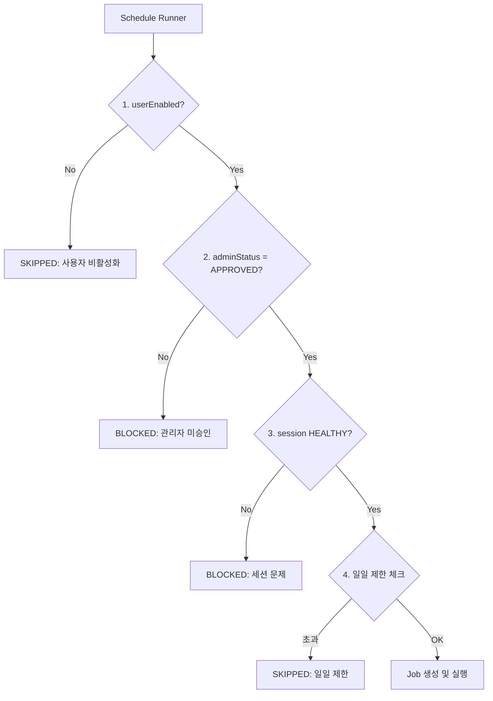

# 카페매니저 운영형 SaaS 고도화 계획

## 현재 상태 분석

기존 구현이 잘 되어 있으나, 다음 영역의 고도화가 필요합니다:| 영역 | 현재 상태 | 목표 상태 ||------|----------|----------|| Schedule 상태 | `status` 단일 필드 | `userEnabled` + `adminStatus` 분리 || NaverSession | 4단계 (PENDING/ACTIVE/EXPIRED/ERROR) | 5단계 + 상세 사유 || Job 실패 처리 | 단순 errorMessage | 표준 errorCode 체계 || Admin 기능 | 없음 | 별도 Admin 앱 + 감사로그 || 실행 조건 | status=ACTIVE만 체크 | 3조건 AND 체크 |---

## Phase 1: 데이터 모델 재설계

### 1.1 Prisma 스키마 변경 ([prisma/schema.prisma](prisma/schema.prisma))

```prisma
// NaverSession 상태 확장
enum SessionStatus {
  HEALTHY           // 정상 동작
  EXPIRING          // 곧 만료 예정 (7일 내)
  EXPIRED           // 만료됨
  CHALLENGE_REQUIRED // 추가 인증 필요 (CAPTCHA/2FA)
  ERROR             // 오류 상태
}

// 관리자 게이트 상태
enum AdminStatus {
  NEEDS_REVIEW      // 승인 대기
  APPROVED          // 승인됨
  SUSPENDED         // 일시 정지
  BANNED            // 영구 차단
}

// Schedule 필드 추가
model Schedule {
  // ... 기존 필드
  userEnabled     Boolean       @default(true)
  adminStatus     AdminStatus   @default(APPROVED)
  adminReason     String?
  suspendedAt     DateTime?
  // ... 
}

// Job 에러 코드 체계
enum ErrorCode {
  AUTH_EXPIRED
  CHALLENGE_REQUIRED
  RATE_LIMIT
  UI_CHANGED
  UPLOAD_FAILED
  NETWORK_ERROR
  PERMISSION_DENIED
  UNKNOWN
}

// AuditLog 신규 모델
model AuditLog {
  id            String    @id @default(cuid())
  actorAdminId  String?
  targetUserId  String
  entityType    String    // SCHEDULE, USER, SESSION
  entityId      String
  action        String    // APPROVE, SUSPEND, BAN
  reason        String?
  metadata      Json?
  createdAt     DateTime  @default(now())
}
```


### 1.2 마이그레이션 전략

- 기존 Schedule의 `adminStatus`는 **APPROVED**로 자동 설정 (선택하신 대로)
- 기존 NaverSession의 `ACTIVE`는 **HEALTHY**로 매핑

---

## Phase 2: 실행 파이프라인 고도화

### 2.1 3조건 체크 로직 ([apps/api/src/modules/schedule/schedule.runner.ts](apps/api/src/modules/schedule/schedule.runner.ts))




### 2.2 Worker 디버그 모드 ([apps/worker/src/jobs/job-processor.ts](apps/worker/src/jobs/job-processor.ts))

- 기본: Headless 모드
- 연속 실패 3회 이상: Debug 모드 자동 전환
- Debug 모드: Headed + 스크린샷/HTML 아티팩트 저장

### 2.3 재시도 정책

| 에러 타입 | 재시도 | 동작 ||----------|--------|------|| NETWORK_ERROR | O | 최대 3회 백오프 || RATE_LIMIT | O | 10분 후 재시도 || AUTH_EXPIRED | X | 세션 상태 전환 + 사용자 알림 || CHALLENGE_REQUIRED | X | 세션 상태 전환 + 수동 해결 유도 |---

## Phase 3: Admin 운영 콘솔 (apps/admin 신규)

### 3.1 프로젝트 구조

```javascript
apps/admin/
  src/
    app/
      layout.tsx
      page.tsx                    # 대시보드
      schedules/                  # 스케줄 승인 큐
        page.tsx
        [id]/page.tsx
      users/                      # 사용자 관리
        page.tsx
        [id]/page.tsx
      sessions/                   # 세션 모니터링
        page.tsx
      audit/                      # 감사 로그
        page.tsx
      policies/                   # 정책 설정
        page.tsx
    components/
      AdminLayout.tsx
      ApprovalQueue.tsx
      SessionMonitor.tsx
      AuditTimeline.tsx
```


### 3.2 주요 화면

1. **스케줄 승인 큐**: NEEDS_REVIEW 목록, 일괄 승인/반려
2. **세션 모니터**: 전체 사용자 연동 상태 (HEALTHY/EXPIRED/CHALLENGE)
3. **감사 로그**: 누가/언제/무엇을/사유 타임라인
4. **정책 설정**: 플랜별 일일 제한, 연속 실패 자동 중지 룰

### 3.3 API 확장 ([apps/api/src/modules/](apps/api/src/modules/))

```javascript
modules/
  admin/
    admin.module.ts
    admin.controller.ts           # GET /admin/schedules, POST /admin/schedules/:id/approve
    admin.service.ts
    dto/
      schedule-review.dto.ts
      audit-query.dto.ts
  audit-log/
    audit-log.module.ts
    audit-log.service.ts
```

---

## Phase 4: Premium UX 프론트엔드

### 4.1 Onboarding Checklist 컴포넌트

```javascript
apps/web/src/components/dashboard/
  OnboardingChecklist.tsx         # 3단계 체크리스트
```


- 네이버 연동 (필수) --> 템플릿 --> 스케줄
- 미완료 항목에 CTA 버튼 제공
- 연동 전 스케줄 ON 불가 + 이유 표시

### 4.2 Schedule 목록 고도화 ([apps/web/src/app/(dashboard)/schedules/page.tsx](apps/web/src/app/\\(dashboard)/schedules/page.tsx))

현재 단일 토글 --> **3조건 상태 표시**로 변경:

```javascript
| 스케줄명 | 사용자 | 관리자 | 세션 | 다음실행 |
|---------|--------|--------|------|---------|
| 중고폰  | ON     | 승인   | 정상 | 오늘 09:00 |
| 아이폰  | ON     | 대기   | -    | (승인 필요) |
```


- 관리자 게이트 OFF 시: 사용자 토글 잠금 + 사유 표시
- "지금 실행" 버튼: 3조건 만족 시만 활성화

### 4.3 JobRun 로그 고도화 ([apps/web/src/app/(dashboard)/logs/page.tsx](apps/web/src/app/\\(dashboard)/logs/page.tsx))

- 상단 필터: 기간/상태/스케줄/검색
- 상태 칩: QUEUED, RUNNING, SUCCESS, FAILED, SKIPPED, BLOCKED
- 상세 Drawer: 요약(원인+해결) / 타임라인 / 증거(스크린샷/HTML)

### 4.4 네이버 연동 페이지 고도화 ([apps/web/src/app/(dashboard)/settings/page.tsx](apps/web/src/app/\\(dashboard)/settings/page.tsx))

- 상태 요약 카드: 배지(HEALTHY/EXPIRING/EXPIRED) + lastChecked
- "연동 테스트" 버튼: 드라이런 (로그인 확인만)
- 히스토리 타임라인 + 문제 해결 아코디언

---

## Phase 5: 품질/운영

### 5.1 AuditLog 자동 기록

모든 ON/OFF/승인/중지 액션에 자동 감사 로그:

```typescript
// apps/api/src/modules/audit-log/audit-log.service.ts
async log(params: {
  actorAdminId?: string;
  targetUserId: string;
  entityType: 'SCHEDULE' | 'USER' | 'SESSION';
  entityId: string;
  action: string;
  reason?: string;
}) { ... }
```


### 5.2 연속 실패 자동 정지

- 5회 연속 실패 시 `adminStatus = SUSPENDED` 자동 전환
- 사용자에게 알림 표시 + 해결 가이드 제공

---

## 구현 순서 (커밋 단위)

| 순서 | 작업 | 예상 파일 ||------|------|----------|| 1 | Prisma 스키마 변경 + 마이그레이션 | `prisma/schema.prisma` || 2 | 타입/상수 정의 | `packages/core/src/types/`, `packages/core/src/constants/` || 3 | Schedule Runner 3조건 체크 | `apps/api/src/modules/schedule/schedule.runner.ts` || 4 | Worker 에러코드 + 디버그 모드 | `apps/worker/src/jobs/job-processor.ts` || 5 | AuditLog 모듈 | `apps/api/src/modules/audit-log/` || 6 | Admin API 모듈 | `apps/api/src/modules/admin/` || 7 | Admin 프론트엔드 앱 | `apps/admin/` || 8 | Web 프론트엔드 고도화 | `apps/web/src/` |---

## 주요 파일 변경 요약

- [prisma/schema.prisma](prisma/schema.prisma): 스키마 확장
- [apps/api/src/modules/schedule/schedule.runner.ts](apps/api/src/modules/schedule/schedule.runner.ts): 3조건 체크
- [apps/api/src/modules/schedule/schedule.service.ts](apps/api/src/modules/schedule/schedule.service.ts): userEnabled/adminStatus 처리
- [apps/worker/src/jobs/job-processor.ts](apps/worker/src/jobs/job-processor.ts): 에러코드 + 디버그 모드
- [packages/core/src/types/index.ts](packages/core/src/types/index.ts): 새로운 타입 정의
- `apps/api/src/modules/admin/` (신규): Admin API
- `apps/api/src/modules/audit-log/` (신규): 감사 로그
- `apps/admin/` (신규): Admin 프론트엔드